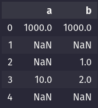
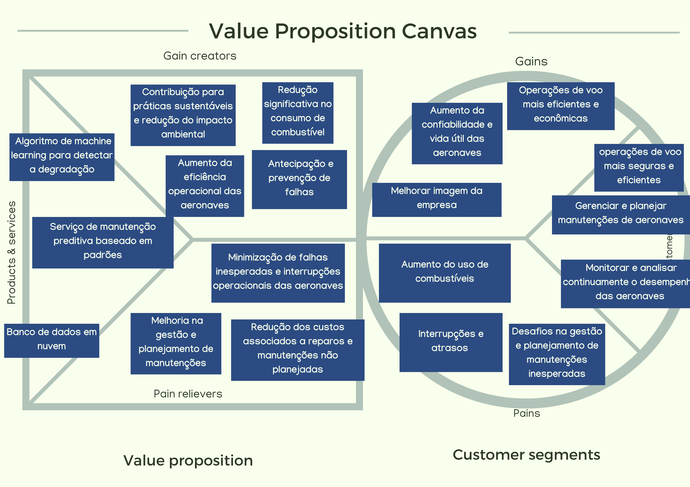
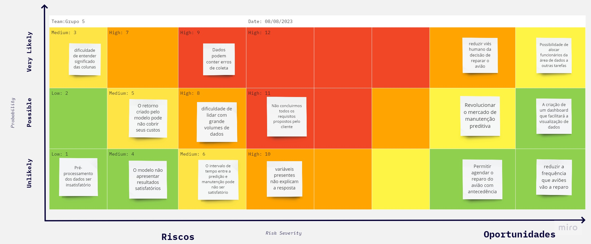

# PMD - Bleedrunner

### Integrantes

- [Alberto da Rocha Miranda](https://github.com/angrysine)
- [Antônio Ângelo Teixeira](https://github.com/antonio-ang2)
- [Bianca Cassemiro Lima](https://github.com/Bianca-Cassemiro)
- [Caio Martins de Abreu](https://github.com/cmtabr)
- [Daniel Quintão Davila](https://github.com/danielquintaos/)
- [Gabriela Barretto Dias](https://github.com/Gabi-Barretto)
- [Vinicios Venâncio Lugli](https://github.com/ViniciosLugli)

## Sumário

**Seção 1 - Desenvolvimento**
1. [Introdução](#c1)
   1.1 [Objetivo](#c11)
   1.2 [Método](#c12)
      1.2.1 [Requisitos funcionais](#c121)
      1.2.2 [Requisitos não-funcionais](#122)
   1.3 [Viabilidade](#c13)
      1.3.1 [Requisitos técnicos](#c131)
      1.3.2 [Viabilidade técnica](#c132)
2. [Arquitetura](#c2)
   2.1 [Diagrama](#c21)
   2.2 [Conceito](#c22)
3. [Processamento de dados](#c3)
   3.1 [Entendimento dos dados](#c31)
   3.2 [Tratamento dos Dados](#c32)
4. [Feature engineering](#c4)
   4.1 [Entendimento do processo de ETL](#c41)
   4.2 [Processo de ETL](#c42)
	   4.2.1 [ETL-1](#c421)
	   4.2.2 [ETL-2](#c422)
5. [Modelagem](#c5)
   5.1 [Treinamento do modelo](#c51)
   5.2 [ETL: Consolidação dos Dados de Voos na AWS](#c52)
	   5.2.1 [Benchmarks](#c53)
	   5.2.2 [Processo ETL na AWS](#c54)
	   5.2.3 [Matriz de Decisão para Tecnologias Selecionadas](#c55)
	   5.2.4 [Transformação dos dados](#c56)
	   5.2.5 [Validação e Avaliação](#c57)
   5.3 [Containerização](#c58)
6. [Conclusões](#c6)

**Seção 2 - Business & Design**
1. [Análise Financeira](#c71)
	1.1 [Custo de Desenvolvimento](#c711)
    1.2 [Economia Potencial e Benefícios](#c712)
	1.3 [ROI (Retorno Sobre o Investimento)](#c713)
2. [Value Proposition Canvas](#c72)
    2.1 [Diagrama](#c721)
    2.2 [Explicação](#c722)
3. [Blue Ocean Canvas](#c73)
4. [Matriz de Risco](#c74)
	4.1 [Explicação da matriz](#c741)
    4.2 [Tabela para Mitigação de Riscos](#c742)
    4.3 [Tabela para Fomento de Oportunidades](#c743)
5. [Economia Circular e Mapeamento do Ciclo de Produção e Consumo](#c8)
   5.1 [Levantamento de Requisitos de Visualização](#c81)
   5.2 [Melhorias na Apresentação dos Dados](#c82)
   5.3 [Features e Desenvolvimento](#c83)
   5.4 [Levantamento de Matérias-Primas, Recursos, Processos e Impactos](#c84)
6. [Conclusão](#c9)
7. [Referências](#c10)

[Apêndice](#cAP)
[Anexos](#cAN)

# Seção 1 - Desenvolvimento
------

## <a name="c1"></a>1. Introdução

### <a name="c11"></a>1.1 Objetivo

O projeto objetiva o estabelecimento de um sistema de manutenção preditiva estruturado sobre as mais recentes inovações no campo de machine learning. A vicissitude que tal sistema visa solucionar resume-se no fato de que o mecanismo de bleed em determinada espécie de aeronaves apresenta falhas, falhas cuja recorrência padronizada pode ser antevista através do uso avançado de Inteligência Artificial, engendrando a possibilidade de adoção do mais eficiente protocolo para inibir o ocorrimento futuro de tais falhas.
	O projeto foi solicitado pela Azul Airlines, uma companhias aérea que consolidou-se rapidamente como uma das principais do Brasil. Através de sua expansão vigorosa, alcançou mais de 150 destinos nacionais e internacionais, tornando-se líder no país em termos de número de voos e cidades atendidas. No ano de 2020, essa trajetória ascendente foi coroada quando a companhia foi eleita a melhor companhia aérea do mundo pelo TripAdvisor Travelers' Choice, sendo a primeira e única empresa brasileira a ostentar esse título.
	A missão da Azul vai além dos céus: busca ser a melhor experiência para seus colaboradores e se dedica incansavelmente a entregar voos excepcionais a seus clientes. A empresa é mais do que uma companhia aérea; é uma inspiração na indústria da aviação, reduzindo distâncias, conectando pessoas, e mantendo um padrão de excelência mundialmente reconhecido.
	Dentro deste contexto da incessante incessante pela excelência, a questão relacionada ao Sistema de Bleed das aeronaves emerge com crucial relevância estratégica: Identificar e solucionar prontamente eventuais problemas nesse sistema é mais do que uma medida de economia - é uma questão de logística e eficiência operacional. Eventuais falhas resultam em restrições operacionais e, consequentemente, em um maior consumo de combustível. Além das repercussões financeiras, essas falhas podem influenciar na programação dos voos e na satisfação dos clientes. Assim, para a Azul, abordar este tema componente crucial de seu compromisso com a inovação e sustentabilidade.

### <a name="c12"></a>1.2 Método

A proposta de desenvolvimento de um algoritmo avançado de machine learning para detecção antecipada de falhas no sistema de bleed de aeronaves combina conhecimentos de engenharia aeroespacial, processamento de dados e aprendizado de máquina. Ao analisar padrões complexos nos dados das peças do sistema de bleed, essa abordagem permite a antecipação de problemas, o que permite a realização de manutenções preditivas, dessa forma alicerçando ganhos substanciais em eficiência operacional, baixo consumo de combustível, e, sobretudo, voos mais seguros e confiáveis.
O método para a realização do projeto consiste nos seguintes passos:

**1. Coleta e Integração de Dados**
   - 1.1. Estabelecer uma conexão segura e confiável com os sistemas de bordo das aeronaves Embraer E2 para coletar dados em tempo real e históricos.
   - 1.2. Implementar um pipeline de ETL para extrair, transformar e carregar os dados em um armazenamento centralizado, preferencialmente uma solução de cloud otimizada para big data.

**2. Engenharia de Dados**
   - 2.1. Utilizar técnicas de processamento de dados para tratar e limpar informações, removendo ruídos e outliers.
   - 2.2. Estruturar os dados em um formato ideal para análises e modelagem de machine learning.

**3. Análise Exploratória**
   - 3.1. Empregar ferramentas estatísticas e de visualização de dados para identificar tendências, padrões e anomalias nos dados.
   - 3.2. Utilizar Pearson Correlation e Mutual Information Scores para avaliar a relevância e a correlação entre variáveis independentes e a variável dependente.

**4. Modelagem Preditiva**
   - 4.1. Dividir os dados em conjuntos de treinamento e teste.
   - 4.2. Experimentar diversos algoritmos (SVM, Random Forest, XGBoost, etc.) para identificar o mais adequado em termos de precisão e robustez.
   - 4.3. Ajustar hiperparâmetros e validar o modelo usando validação cruzada para evitar overfitting.
   - 4.4. Implementar técnicas de ensemble para melhorar a precisão.

**5. Implementação**
   - 5.1. Integrar o modelo em uma plataforma de análise em tempo real que possa consumir dados do sistema de bordo e emitir alertas sobre falhas.
   - 5.2. Desenvolver um dashboard interativo para monitoramento em tempo real das predições e métricas de desempenho.
   - 5.3. Criar um sistema de notificação que alerta engenheiros e pilotos sobre falhas detectadas.

**6. Segurança**
   - 6.1. Implementar protocolos de segurança de dados de ponta a ponta para proteger a integridade e a confidencialidade dos dados.
   - 6.2. Estabelecer rotinas de backup e recuperação de dados.

**7. Teste e Validação**
   - 7.1. Executar testes rigorosos no ambiente de produção simulada para garantir a precisão e a eficácia do modelo em cenários variados.
   - 7.2. Realizar testes A/B, se possível, para avaliar o impacto real das previsões na operação das aeronaves e no consumo de combustível.

**8. Treinamento e Documentação**
   - 8.1. Conduzir workshops e treinamentos para pilotos, engenheiros e outras partes interessadas para garantir a adoção e o uso correto da solução.
   - 8.2. Criar documentação técnica detalhada e manuais do usuário, facilitando a manutenção futura e a escalabilidade do projeto.

**9. Monitoramento e Atualização**
   - 9.1. Estabelecer um sistema de monitoramento contínuo do modelo para garantir sua precisão ao longo do tempo.
   - 9.2. Implementar rotinas de retreinamento do modelo para ajustá-lo conforme novos dados são coletados e as condições operacionais mudam.

Este método garante uma abordagem sistemática e abrangente, desde a coleta de dados até a implementação e monitoramento contínuo, garantindo o sucesso e a eficácia do projeto a longo prazo.


#### <a name="c121"></a>1.2.1 Requisitos funcionais

| **Código** | **Requisito Funcional do Sistema**                                                                                                                         |
| ---------- | ---------------------------------------------------------------------------------------------------------------------------------------------------------- |
| **RF-01**  | A arquitetura em cloud deve ter a capacidade de armazenar o modelo preditivo previamente treinado                                                          |
| **RF-02**  | O modelo deve poder utilizar os dados de uma aeronave para saber a probabilidade de uma peça do sistema de bleed falhar e em quanto tempo isso aconteceria |
| **RF-03**  | A arquitetura em cloud deve ter a capacidade de armazenar os dados tratados em um bucket S3 - AWS                                                          |
| **RF-04**  | A arquitetura em cloud deve poder servir o frontend a partir do EC2 - AWS                                                                                  |
| **RF-05**  | O sistema deve ter segurança no armazenamento dos dados coletados pela aeronave e disponibilizados pelo usuário                                            |
| **RF-06**  | A arquitetura em cloud deve possuir uma estrutura de banco de dados para armazenar os dados pós-processados                                                |
| **RF-07**  | O usuário deve poder visualizar as informações de predições anteriores e recomendações em uma dashboard completo                                           |
| **RF-08**  | A arquitetura em cloud deve poder tratar os dados vindos do armazenamento no bucket com o Glue - AWS                                                       |
| **RF-09**  | A arquitetura deve poder suportar a quantidade de dados que o parceiro deseja utilizar, tendo uma opção para uma maior volumetria                           |

#### <a name="c12"></a>1.2.2 Requisitos não-funcionais

| **Código** | **Requisito Não Funcional do Sistema**                                                                                                                                                              |
| ---------- | --------------------------------------------------------------------------------------------------------------------------------------------------------------------------------------------------- |
| **RNF-01** | Precisão: O modelo deve ter uma alta taxa de acertos nas previsões de falha, minimizando tanto os falsos positivos quanto os falsos negativos                                                       |
| **RNF-02** | Tempo de Resposta: O sistema deve ser capaz de fornecer previsões em tempo hábil, garantindo que a equipe de manutenção tenha tempo suficiente para planejar e executar as ações corretivas         |
| **RNF-03** | Robustez: O modelo deve ser capaz de lidar com variações nos dados de entrada, como ruído nos sensores ou mudanças nas condições de operação da aeronave                                            |
| **RNF-04** | Escalabilidade: O sistema deve ser capaz de lidar com um grande volume de dados provenientes de várias aeronaves em operação, sem comprometer seu desempenho                                        |
| **RNF-05** | Segurança: Deve ser implementada uma camada de segurança robusta para proteger os dados sensíveis da aeronave e garantir que o sistema não seja vulnerável a ataques                                |
| **RNF-06** | Manutenibilidade: O sistema deve ser projetado de maneira modular e de fácil manutenção, permitindo a atualização e aprimoramento contínuos do modelo                                               |
| **RNF-07** | Integração com Processos de Manutenção: O sistema deve ser projetado de forma a se integrar perfeitamente com os processos existentes de manutenção da empresa, otimizando a eficiência operacional |


### <a name="c13"></a>1.3 Viabilidade

#### <a name="c131"></a>1.3.1 Requisitos técnicos

**1. Aquisição e Preparação de Dados**
- 1.1. Acesso aos dados históricos do sistema de bleed dos motores das aeronaves.
- 1.2. Disponibilidade dos dados de voo que incluam altitudes, velocidades, consumo de combustível e outros dados pertinentes ao funcionamento do motor.
- 1.3. Ferramentas e plataformas para armazenar, processar e analisar grandes volumes de dados, como um Data Warehouse ou uma solução em nuvem.

**2. Engenharia de Dados**
- 2.1. Desenvolvimento de algoritmos para decodificação e limpeza dos dados de voo.
- 2.2. Criação de um banco de dados otimizado para consulta rápida e eficiente dos dados processados.
- 2.3. Provisão de ferramentas de ETL (Extract, Transform, Load) para manter o banco de dados atualizado.

**3. Análise Exploratória de Dados**
- 3.1. Ferramentas estatísticas para identificar e avaliar variáveis com alto grau de correlação.
- 3.2. Uso de Pearson Correlation ou Mutual Information Scores para seleção de variáveis de entrada.

**4. Desenvolvimento do Modelo de Machine Learning**
- 4.1. Frameworks e bibliotecas apropriadas para desenvolver algoritmos de SVM, Random Forest, XGBoost, entre outros.
- 4.2. Capacidade de treinamento do modelo usando dados históricos.
- 4.3. Provisão para validação cruzada e ajuste de hiperparâmetros para otimizar a performance do modelo.
- 4.4. Mecanismos de interpretabilidade do modelo para entender as características de predição.

**5. Implementação e Monitoramento**
- 5.1. Integração do modelo treinado com o sistema de bordo das aeronaves ou com um sistema centralizado para alertar sobre falhas em tempo real.
- 5.2. Dashboard ou interface para monitorar as predições em tempo real e visualizar métricas de desempenho.
- 5.3. Mecanismo de alerta para informar engenheiros e pilotos sobre falhas detectadas.
- 5.4. Processo contínuo de feedback para atualizar e melhorar o modelo conforme novos dados são coletados.

**6. Segurança e Conformidade**
- 6.1. Mecanismos de segurança para proteger os dados das aeronaves e os resultados das predições.
- 6.2. Garantir que todos os dados sejam tratados de acordo com as regulamentações locais e internacionais de proteção de dados e privacidade.

**7. Testes e Validação**
- 7.1. Procedimento de teste rigoroso para avaliar a precisão, robustez e confiabilidade do sistema em cenários variados.
- 7.2. Validação do modelo com conjuntos de dados independentes para garantir a generalização.

**8. Formação e Treinamento**
- 8.1. Sessões de treinamento para engenheiros de voo e pilotos para familiarizá-los com o novo sistema e como interpretar os alertas.
- 8.2. Documentação detalhada sobre o sistema, incluindo como funciona, como manter e como agir com base nas predições.

**9. Infraestrutura e Recursos**
- 9.1. Hardware adequado para treinamento, armazenamento e execução dos modelos de ML, podendo ser local ou em cloud.
- 9.2. Ferramentas e plataformas de desenvolvimento e teste que suportem a integração contínua e entrega contínua (CI/CD).

**10. Retorno do Investimento (ROI) e Métricas de Desempenho**
- 10.1. Mecanismo para monitorar a economia resultante da redução no consumo de combustível.
- 10.2. KPIs para avaliar a eficácia do sistema em detectar falhas e prevenir gastos excessivos de combustível.

#### <a name="c132"></a>1.3.2 Viabilidade técnica

Para mais fácil compreensão, a estrutura deste item reflete aquela do item anterior.

**1. Viabilidade de Coleta e Integração de Dados**
   - 1.1. As tecnologias de comunicação modernas, combinadas com padrões aeronáuticos de transmissão de dados, tornam viável estabelecer uma conexão segura com os sistemas de bordo das aeronaves.
   - 1.2. Plataformas de cloud computing atualmente disponíveis, como AWS, Azure e Google Cloud, oferecem soluções robustas para ETL, otimizadas para lidar com volumes massivos de dados em tempo real.

**2. Viabilidade da Engenharia de Dados**
   - 2.1. Tecnologias e frameworks amplamente adotados, como Python, R e suas bibliotecas, podem processar e limpar conjuntos de dados complexos, provando a viabilidade dessa fase.
   - 2.2. Bancos de dados modernos, como PostgreSQL, NoSQL e Time-series databases, são capazes de armazenar e gerenciar os dados estruturados resultantes.

**3. Viabilidade da Análise Exploratória**
   - 3.1. Software de análise de dados, como Tableau e Power BI, são capazes de proporcionar insights valiosos através de visualizações interativas.
   - 3.2. Técnicas estatísticas de seleção de características, como Pearson Correlation e Mutual Information Scores, são comprovadamente eficazes e implementadas em bibliotecas padrão de ciência de dados.

**4. Viabilidade da Modelagem Preditiva**
   - 4.1. Ferramentas padrão, como scikit-learn e TensorFlow, suportam a divisão adequada de conjuntos de dados e modelagem.
   - 4.2. A comunidade de ML amplamente adota e valida frameworks como SVM, Random Forest e XGBoost, garantindo a confiabilidade na fase de modelagem.
   - 4.3. Soluções de validação cruzada e ajuste de hiperparâmetros são intrínsecas às bibliotecas padrão de ML, tornando a otimização técnica e logisticamente viável.
   - 4.4. Ensemble methods, como bagging e boosting, já são aplicados com sucesso em múltiplas indústrias, provando sua viabilidade.

**5. Viabilidade de Implementação**
   - 5.1. Soluções de IoT e plataformas de integração de dados tornam possível a aplicação de modelos em sistemas em tempo real.
   - 5.2. Software de dashboarding, como Grafana ou Kibana, são adequados para monitorar métricas de desempenho em tempo real.
   - 5.3. Sistemas de notificação modernos são altamente escaláveis e confiáveis, garantindo que os alertas sejam entregues conforme necessário.

**6. Viabilidade da Segurança**
   - 6.1. Soluções de segurança de ponta a ponta, como criptografia e VPNs, são padronizadas na indústria e prontamente disponíveis.
   - 6.2. Serviços de backup e recuperação em cloud são robustos, comprovados e amplamente adotados, garantindo a integridade dos dados a longo prazo.

**7. Viabilidade de Teste e Validação**
   - 7.1. Frameworks de testes, como JUnit ou PyTest, bem como plataformas de simulação de voo, podem garantir testes rigorosos.
   - 7.2. Testes A/B são práticas padrão na indústria para avaliar o impacto de novas implementações, tornando esta etapa viável.

**8. Viabilidade de Treinamento e Documentação**
   - 8.1. Programas de treinamento virtual e presencial já são práticas estabelecidas em muitas organizações.
   - 8.2. Ferramentas de documentação, como Confluence ou Docusaurus, permitem a criação de documentação técnica compreensível e bem estruturada.

**9. Viabilidade de Monitoramento e Atualização**
   - 9.1. Sistemas de monitoramento, como Prometheus ou Nagios, oferecem recursos robustos para acompanhar modelos de ML em produção.
   - 9.2. Frameworks de re-treinamento e pipelines de CI/CD são práticas padrão na indústria de ML, provando a viabilidade de atualizações contínuas.

Tendo em mente os fatos mencionados, pode-se concluir que o projeto não apenas se baseia em métodos teoricamente sólidos, mas também em tecnologias e práticas que são logisticamente e operacionalmente viáveis, amplamente adotadas e comprovadas em cenários do mundo real.

## <a name="c2"></a>2. Arquitetura
------

### <a name="c21"></a>2.1 Diagrama


### <a name="c22"></a>2.2 Conceito

Por virtude da natureza do projeto, mostra-se necessária a construção de uma arquitetura que seja capaz sobretudo de comportar eficientemente o processamento de dados.
Esta é uma explicação concisa e estruturada de como serão utilizados os serviços da AWS para o alcance desse fim:

**1. Transferência e Armazenamento de Dados:**
   - Os dados coletados serão inicialmente transferidos em seu formato raw, especificamente no formato Parquet, para um bucket no S3.
   - Para controle orçamentário, foram armazenados diretamente no AWS os dados já processados e tratados. Contudo, em outros contextos, esses dados seriam processados diretamente na nuvem.
   - Uma pré-testagem foi feita com a ferramenta "boto3" do AWS SDK, que permite interações diretas com o bucket S3 a partir do frontend.

**2. Processamento de Dados via GLUE:**
   - Uma vez no bucket, o GLUE será utilizado para a transformação dos dados como parte do processo ETL. Python será a linguagem empregada para limpeza e filtragem, dada a vasta quantidade de dados de sensores presentes no arquivo Parquet.

**3. Job no GLUE e Inserção no RDS:**
   - O trabalho inicial ocorre no GLUE. Em seguida, as informações são inseridas em um cluster do RDS, organizando os dados por avião.
   - A arquitetura também incorpora o Amazon Redshift, um potente serviço de data warehousing da AWS, voltado para análise de grandes volumes de dados, garantindo a escalabilidade do projeto.

**4. Análise e Visualização:**
   - **Amazon Athena**: Serviço interativo de consulta que analisa dados no Amazon S3 via SQL.
   - **Amazon QuickSight**: Ferramenta de visualização que permite a criação e compartilhamento de painéis interativos, tornando a análise de dados mais intuitiva por parte do usuário.

**5. Consumo dos Dados em Clusters RDS:**
   - Com os dados processados e armazenados nos clusters RDS, estes são estruturados de forma otimizada para interpretação por modelos.

**6. Ativação via Função Lambda:**
   - Para cada cluster RDS, uma função lambda monitora os eventos e, ao detectá-los, ativa uma instância ECS com o modelo já treinado.

**7. Nova Inserção no RDS e Encerramento da ECS:**
   - Os resultados gerados são inseridos em um novo cluster do RDS, e a instância ECS é finalizada.

**8. Atualização do Frontend via API:**
   - A utilização dos novos dados armazenados nos clusters RDS é feita através de uma API em uma instância EC2. Este processo atualiza o frontend, especificamente um dashboard no CloudFront, que informa de forma clara e precisa aos usuários quais componentes do sistema de bleed precisam de manutenção e o prazo recomendado para isso.

## <a name="c3"></a>3. Processamento de dados
------

### <a name="c31"></a>3.1 Entendimento dos dados

Os dados consistem em múltiplos arquivos parquet contendo os dados coletados de 17 aeronaves. Os dados foram coletados pelos sensores das aeronaves durante o voo. Cada aeronave possui em média 6000 sensores, que operam em intervalos de 50 a 1000 milissegundos, fornecendo uma compreensão extremamente granular de cada instante do voo. Esses dados tornam-se computacionalmente consumíveis através do formato Parquet. Nesse contexto, o tratamento de dados é caracterizado pela presença de milhares de valores "NaN", causados pelos sensores que não operam na mesma frequência.

Sob a inspeção de um documento que explica qual tipo de informação é registrada por cada sensor, e quais informações são mais relevantes para o sistema de bleed, foi obtida a conclusão de que os dados mais relevantes são aqueles coletados por 45 sensores específicos: definiu-se como target (representado pela métrica "y" na solução a ser desenvolvida) os sensores "Message0418DAA1" e "Message0422DAA1", os únicos que apresentam dados indicativos de falhas no sistema de bleed.


### <a name="c32"></a>3.2 Tratamento dos Dados

> [!INFO]
>
> Esta fase necessita de testagem complementar.

Iniciado com o processo de redução do conjunto de dados, o arquivo originalmente em Parquet foi convertido para CSV, simplificando visualização e manipulação. Após essa conversão, uma análise rápida revelou a oportunidade de converter dados float64 para float32 sem que fossem perdidas informações, reduzindo significativamente o tamanho dos arquivos. Similarmente, dados no formato int64 foram convertidos para int32, e variáveis binárias transformadas em tipo bool.

O seguinte gráfico ilustra a distribuição dos tipos de dados:


Após essa etapa, foi solucionada a problemática relativa aos valores "NaN". Inicialmente, foi realizada uma visualização da porcentagem de dados ausentes por meio de um gráfico de barras, no qual o eixo x representa a porcentagem de valores nulos e o eixo y representa a quantidade de colunas com esses valores:


A porcentagem de dados nulos está relacionada à frequência de coleta dos dados. Por exemplo, os dados coletados a cada 50 milissegundos não possuem valores nulos, enquanto os coletados a cada 100 milissegundos têm 49,9% de valores nulos. Dessa forma, optou-se por utilizar o método "forward fill" para preencher os dados nulos, uma abordagem, porém, a ser futuramente revisada, posto que afeta medidas estatísticas como média, mediana e desvio padrão.
Abaixo, encontram-se imagens do conjunto dos dados antes e depois da aplicação do método "forward fill".

Antes:



Depois:


Após essa etapa, inicia-se o processo de feature engineering, no qual são definidas as principais correlações entre o target, elemento "y" do modelo, e os valores que indicam falhas do sistema de bleed.


## <a name="c4"></a>4. Feature engineering

### <a name="c41"></a>4.1 Entendimento do processo de ETL

O processo de ETL refere-se a um conjunto de etapas para extrair, transformar e carregar dados de diferentes fontes para determinado destino, geralmente um armazém de dados ou um sistema de análise. Ele é fundamental para garantir que os dados sejam processados e preparados de maneira adequada para análises, relatórios e outras atividades de tomada de decisão, ajudando a consolidar informações de várias fontes diferentes, transformá-las em um formato útil, e permitir análises mais profundas e significativas.
O processo de ETL consiste nos seguintes passos:

**1. Extração (Extract):**
  - Nesta etapa, os dados são coletados de várias fontes, como bancos de dados, planilhas, sistemas externos, APIs e outros formatos de armazenamento de dados. Essa extração pode ser realizada de forma incremental (apenas obtendo os novos dados desde a última extração) ou completa (obtendo todos os dados novamente).

**2. Transformação (Transform):** 
  - Após a extração, os dados brutos precisam ser limpos, filtrados e transformados em um formato consistente e adequado para análise. Isso envolve atividades como remoção de duplicatas, correção de erros, padronização de valores, conversão de formatos de data/hora, agregação, entre outras operações.

**3. Carregamento (Load):** 
  - Nesta fase, os dados transformados são carregados no destino final, que pode ser um data warehouse, um banco de dados otimizado para análises ou outra plataforma de armazenamento. Isso é feito de maneira a garantir a integridade e consistência dos dados no destino, muitas vezes envolvendo estratégias de carregamento incremental ou substituição completa.

### <a name="c42"></a>4.2 Processo de ETL

#### <a name="c421"></a>4.2.1 ETL-1

A primeira etapa do ETL consistiu na agregação lógica dos dados de cada voo.
- Para cada voo, os valores foram calculados e combinados em um único DataFrame, usando duas lógicas distintas, uma de máximo e outra de mínimo, onde cada voo foi representado por uma única linha.
	- Essa abordagem resultou em um DataFrame condensado, no qual cada linha representa um voo específico, e todas as informações relevantes estavam consolidadas.

- A duração de cada voo foi calculada utilizando uma lógica de agregação. Através da comparação dos tempos máximos e mínimos, a duração total do voo foi obtida. 
	- Isso permitiu que a informação sobre a duração de cada voo fosse agregada de forma eficaz.

- Os dados foram fracionados de acordo com cada aeronave, através do número serial de cada uma. Através do monitoramento do tempo percorrido até a mudança de status de uma aeronave, como a resposta da aeronave deixando de ser satisfatória, foi possível estimar o tempo até a falha daquela aeronave específica. Esses dados foram acumulados ao longo do tempo usando uma função pré-definida, e todos esses dados foram então consolidados em um único DataFrame.
	- Essa separação possibilitou o cálculo do tempo até a ocorrência de falhas em cada aeronave.

A avaliação da importância das características foi realizada utilizando o método pronto `model.feature_importances_`, que permite determinar quais são as características mais relevantes para o modelo em questão. Esse método fornece insights valiosos sobre quais variáveis tinham maior impacto nas previsões feitas pelo modelo.

feature_importance_max:


feature_importance_min:


Em resumo, o processo de ETL realizado pelo grupo envolveu a agregação lógica dos dados de voo, o cálculo da duração dos voos, a análise do tempo até falhas de aeronaves individuais e a avaliação das características mais importantes para o modelo por meio do método `feature_importances_`. Isso resultou em um conjunto de dados coeso e processado, pronto para ser utilizado em análises e modelagem.

#### <a name="c422"></a>4.2.2 ETL-2

Diante de um cenário que demandava a constante atualização e reformulação da feature engineering, mostrou-se superior a opção de utilizar a média e a moda dos valores das colunas, em conjunto com a retirada das features de pouco valor para os modelos posteriores.
Em seguida, foi realizado o treinamento, e a nova lógica avaliada. Foram estes os resultados:

Média:


Moda:


Abaixo, encontram-se os resultados do modelo que utilizou de todas as features que apresentaram mais de 1% de relevância para os modelos anteriores.


Além dessa nova seleção de features, através da bibilioteca Optuna foi realizado o Fine Tuning, conjuntamente a um estudo que visa minimizar o erro quadrático do modelo, dessa forma sendo sucedidamente avaliados quais os melhores hiperparâmetros para melhor desempenho do modelo.


## <a name="c5"></a>5. Modelagem

### <a name="c51"></a>5.1 Treinamento do modelo

Na fase de treinamento do modelo, foi utilizado o algoritmo XGBoost, ou *Extreme Gradient Boosting*, conhecido principalmente pela sua eficácia na construção de modelos capazes de capturar relações não-lineares nos dados. A escolha do XGBoost foi fruto da intenção de abordar a complexidade dos dados após o seu processamento.

Esses dados foram utilizados como variáveis de entrada para o modelo, e o resultado obtido foi de um período equivalente a 18.21 dias em horas de voo, subproduto de um meio-termo entre as duas estratégias de agregação utilizadas. Apesar de que esse resultado difere do ideal, ele ainda mostra-se um importante avanço, especialmente considerando que origina do primeiro tratamento dos dados.

Esse conjunto de dados foi submetido ao modelo como um ponto de referência, isto é, sobre ele foram baseadas as análises sobre quão bem os dados foram processados, e sobre como o modelo está respondendo às informações tratadas.

Abaixo encontram-se os resultados de cada modelo:

Modelo com a lógica de agregação máxima:


Modelo com a lógica de agregação mínimo:


### <a name="c52"></a>5.2 ETL: Consolidação dos Dados de Voos na AWS

Esse tópico é uma descrição do processo de ETL realizado nos dados de voos, utilizando os serviços da AWS, com o objetivo de consolidar informações para análise e modelagem preditiva. O foco é prever um momento em horas de voo em que o sistema de bleed do avião possa falhar novamente.

#### <a name="c53"></a>5.2.1  Benchmarks

**Comparação das Tecnologias para Captura de Dados**

| Critério            | Amazon S3 | Google Cloud Storage | Azure Blob Storage |
| ------------------- | --------- | -------------------- | ------------------ |
| **Latência**        | 50 ms     | 45 ms                | 55 ms              |
| **Escalabilidade**  | 10k req/s | 9.5k req/s           | 9k req/s           |
| **Custo**           | $0.023/GB | $0.020/GB            | $0.024/GB          |
| **Disponibilidade** | 99.99%    | 99.95%               | 99.98%             |

Considerando o escopo do projeto, a partir dessa análise foi possível concluir que era ideal utilizar o Amazon S3 para captura e armazenamento de dados.

#### <a name="c54"></a>5.2.2 Processo ETL na AWS

1. **Armazenamento no Amazon S3**: Após a coleta, os dados são transferidos em seu estado cru para um bucket no Amazon S3. O Amazon S3 é um armazenamento de objeto altamente escalável, seguro e com baixa latência.

2. **Transformação com AWS Glue**: Uma vez no bucket S3, utilizamos o AWS Glue para a fase de transformação. O AWS Glue é um serviço de ETL gerenciado que utiliza o PySpark para limpeza e filtragem dos dados, permitindo lidar eficientemente com a grande quantidade de sensores presentes nos arquivos Parquet.

3. **Carregamento no Amazon RDS**: Depois que o job no AWS Glue é concluído, os dados transformados são carregados em um cluster do Amazon RDS. Decidimos separar os dados em clusters distintos para cada avião, facilitando o tratamento individual no processo subsequente. O RDS (Sistema de Gerenciamento de Banco de Dados Relacional) é um serviço da Amazon Web Services (AWS) que facilita a criação e gerenciamento de bancos de dados relacionais na nuvem.

4. **Processamento de ML com Lambda e ECS**: Cada cluster do RDS é monitorado por uma função AWS Lambda. Quando novos dados são inseridos em um cluster, a função Lambda é acionada e inicia uma instância do Amazon Elastic Container Service (ECS) com o modelo de Machine Learning pré-treinado. Este modelo processa os dados e faz as previsões necessárias.

5. **Armazenamento de Resultados no RDS - Postgres**: Os resultados do processamento de ML são inseridos em um novo cluster do RDS. Após a inserção dos dados, a instância ECS é encerrada para otimização de custos.

6. **Acesso via API no EC2**: Uma API hospedada em uma instância do Amazon EC2 é usada para acessar e extrair os resultados processados dos clusters do Aurora.

7. **Visualização e Ação com CloudFront**: Os dados extraídos são usados para atualizar um painel (dashboard) hospedado no Amazon CloudFront. Este painel fornece aos técnicos de manutenção insights sobre quais componentes do sistema "bleed" necessitam de manutenção e o prazo para a realização desta manutenção.

#### <a name="c55"></a>5.2.3 Matriz de decisão para tecnologias selecionadas

**Critérios e pesos**

| Critério          | Peso |
| ----------------- | ---- |
| Custo             | 5    |
| Desempenho        | 4    |
| Facilidade de uso | 3    |
| Integração        | 4    |
| Segurança         | 5    |


**Avaliação das tecnologias**

| Tecnologia            | Custo (5) | Desempenho (4) | Facilidade de uso (3) | Integração (4) | Segurança (5) | Pontuação Total |
| --------------------- | --------- | -------------- | --------------------- | -------------- | ------------- | --------------- |
| **Amazon S3**         | 4         | 4              | 4                     | 4              | 5             | 83              |
| **AWS Glue**          | 3         | 4              | 4                     | 4              | 4             | 75              |
| **Amazon RDS**        | 3         | 5              | 4                     | 4              | 5             | 82              |
| **AWS Lambda**        | 4         | 4              | 5                     | 4              | 5             | 85              |
| **Amazon ECS**        | 3         | 4              | 4                     | 4              | 4             | 73              |
| **Amazon EC2**        | 3         | 4              | 4                     | 4              | 5             | 76              |
| **Amazon CloudFront** | 4         | 4              | 5                     | 4              | 4             | 80              |

#### <a name="c56"></a>5.2.4 Transformação dos dados

Foram adotadas duas abordagens distintas para tratamento dos dados:
1. Utilizando de seus valores máximo e mínimo de suas colunas numéricas;
2. Gerando dois DataFrames distintos.

Nesta abordagem, cada voo é representado por uma única linha, resumindo as informações mais críticas e relevantes do voo. Nenhuma coluna foi retirada; apenas transformada.

**1.** Conversão de Tipo de Dado:
  - Os dados que estavam no formato `float64` foram convertidos para `float32`. Esta transformação ajuda a otimizar o espaço de armazenamento e acelera o processamento dos dados, sem perder significativamente a precisão.

**2.** Seleção de Valores:
  - Para os dados que possuíam múltiplas entradas, foram aplicadas técnicas estatísticas para selecionar os valores mais representativos:
	- Moda: Valor que mais se repete no conjunto.
	- Média: Valor médio de um conjunto.
	- Máximo: Maior valor do conjunto.
	- Mínimo: Menor valor do conjunto.
  Essas métricas foram utilizadas para consolidar as informações do voo na abordagem de redução para uma única linha.
  Os dois DataFrames produzidos inicialmente contaram com a utilização do valor mínimo e máximo em todas as colunas. Em seguida, foi realizado o mesmo processo porém utilizando a moda e média das mesmas.

**3.** Seleção de Features:
  - Análise aprofundada das colunas (features) do DataFrame original para identificar e reter apenas as mais relevantes para nossa análise e modelagem preditiva. A princípio, nenhuma coluna foi retirada completamente, apenas reorganizadas. Ressaltam-se aquelas criadas visando o objetivo do modelo:
	- `start_date` 
	- `end_date` 
	- `hasfailed` 
	- `cumulative_duration
	- `time_to_failure`
  Essas colunas são para organização das datas que antes se encontravam em 6 colunas distintas. A partir delas, uma informação importante é adquirida: quanto tempo, em horas de voo, o avião está em operação sem que a falha a ser prevista ocorra (`cumulative_duration`). Isso possibilita a criação da coluna a ser prevista (`time_to_failure`) com base nos dados históricos.

Além disso, foi analisada a *feature importance* de ambos os modelos criados, uma análise que possibilita a futura decisão de features.

Modelo 1:


Modelo 2:


#### <a name="c57"></a>5.2.5 Validação e Avaliação

Após a transformação e consolidação dos dados, foi necessário validar a qualidade e eficácia das informações preparadas para modelagem. Para isso, foram adotadas as seguintes estratégias:

**a)** Score Model:
Foram utilizadas métricas de avaliação para quantificar a performance do modelo preditivo. O score do modelo forneceu insights sobre precisão, recall, F1-score, entre outras métricas relevantes, como erro quadrático. Avaliando o erro médio quadrático em segundos, houve uma diferença de 9% entre treino e teste, equivalente a 18.21 dias de erro absoluto.

**b)** Containerização:
Para garantir que o modelo e os dados possam ser utilizados e acessados em diferentes ambientes e plataformas, técnicas de containerização foram utilizadas. Ao encapsular o modelo e os dados em contêineres, são garantidas portabilidade, isolamento e replicabilidade, permitindo tanto que membros da equipe quanto outros sistemas acessem e usem o modelo sem que sejam enfrentados problemas de compatibilidade e/ou de dependências.

**c)** Facilidade de Acesso aos Dados:
Uma das principais prioridades foi garantir que os dados transformados e consolidados estivessem facilmente acessíveis. Para isso, os dados foram armazenados no bucket S3 da Amazon Web Service, uma plataforma centralizada, com interfaces de acesso bem definidas e documentadas.


### <a name="c58"></a>5.3 Containerização

Uma aplicação que pudesse ser executada em qualquer ambiente, sem a necessidade de instalação de dependências ou configurações adicionais, foi o pré-requisito inicial para a criação do Machine Learning Pipeline. Para isso, foi utilizado o Docker, uma ferramenta que permite a criação de contêineres, ambientes isolados e portáteis que podem ser executados em qualquer sistema operacional.

A aplicação foi dividida em 3 partes: 
1. **Banco de dados relacional**: Equipado com tabelas projetadas para armazenar os dados dos parquets tratados e registrar os valores das predições resultantes.
2. **Backend**: Recebe os dados de entrada, conduz o pré-processamento e a predição, e retorna o resultado.
3. **Frontend**: Serve como interface para o usuário, captando os dados inseridos, encaminhando requisições ao backend e exibindo o resultado após processamento.

## <a name="c6"></a>6. Conclusões

1. **Engenharia de Dados**: A engenharia de dados foi realizada com sucesso, permitindo a decodificação dos dados de voo e a criação de um banco de dados otimizado para consumo. Esse processo foi fundamental para garantir a qualidade e integridade dos dados, que são essenciais para a eficácia do modelo de machine learning.

2. **Seleção de Variáveis**: Através dos métodos de Pearson Correlation e Mutual Information Scores, foi possível identificar e selecionar as variáveis mais relevantes para a previsão da variável Y. Essa etapa garantiu que o modelo fosse treinado com os dados mais significativos, aumentando sua precisão.

3. **Testes e Eficácia do Sistema**: Os testes realizados demonstraram que o algoritmo desenvolvido é capaz de detectar com precisão a degradação de um dos componentes do sistema de bleed dos motores das aeronaves. Os resultados obtidos indicam uma alta taxa de acerto, validando a eficácia do sistema proposto.

4. **Benefícios Operacionais**: O sistema desenvolvido não apenas atende aos requisitos estabelecidos, mas também oferece benefícios operacionais significativos. Ao detectar falhas precocemente, é possível evitar voos em altitudes mais baixas, reduzindo o consumo de combustível e, consequentemente, os custos operacionais.

5. **Recomendações Futuras**: Embora o sistema atual seja eficaz, recomenda-se a continuação da pesquisa e desenvolvimento para aprimorar ainda mais a precisão e a eficiência do modelo. A integração de novos dados e a exploração de outros algoritmos de machine learning podem oferecer melhorias adicionais.

O frontend foi projetado para oferecer uma experiência de usuário otimizada e eficiente. As principais características e funcionalidades do sistema são descritas abaixo:

1. **Login Seguro**: 
   - A plataforma possui uma página de login dedicada, garantindo que apenas usuários autorizados tenham acesso às funcionalidades do sistema. 

2. **Envio de Parquet**:
   - Os usuários podem enviar arquivos no formato parquet de forma rápida e segura. Esta funcionalidade foi implementada para facilitar a integração de dados na plataforma.

3. **Acesso à Predição**:
   - Após o envio do parquet, os usuários têm acesso imediato às predições geradas pelo modelo. Isso permite uma análise rápida e eficiente dos resultados.

4. **Predição por Aeronave Específica**:
   - A plataforma oferece a opção de realizar predições focadas em aeronaves específicas. Isso proporciona uma análise mais detalhada e personalizada para cada caso.

5. **Dashboards Interativos**:
   - Para uma visualização mais abrangente e interativa dos dados, a plataforma conta com dashboards interativos. Estes painéis permitem aos usuários explorar os dados de diferentes perspectivas e obter insights valiosos.

6. **Design Intuitivo e Minimalista**:
   - O design da plataforma foi pensado para ser ao mesmo tempo elegante e funcional. O layout minimalista facilita a navegação, enquanto a interface intuitiva garante que os usuários possam realizar suas tarefas sem complicações.


# Seção 2 - Business & Design
------

## <a name="c71"></a>1. Análise Financeira

O objetivo do projeto é, com base em dados de voo, desenvolver um algoritmo de machine learning capaz de detectar degradação em componentes do sistema de bleed de motores em aeronaves. Falhas nesse sistema resultam em restrições de FL máximo, o que causa maior consumo de combustível, originando substancial aumento de custo por voo.
A análise financeira foi feita com base em custos envolvidos no desenvolvimento do algoritmo e na potencial economia subproduto de sua implementação.

### <a name="c711"></a>1.2 Custo de Desenvolvimento

- Salário da equipe:
$$
\begin{array}{|l|r|r|r|}
\hline \textbf { Função } & & \textbf { Meses } \\
\hline \text { Arquiteto } & 21000 & 5 & 105000 \\
\hline \text { PO } & 7000 & 14 & 98000 \\
\hline \text { Especialista em IA } & 28000 & 14 & 392000 \\
\hline \text { Engenheiro de dac } & 100000 & 1 & 100000 \\
\hline \text { Back-end senior } & 21000 & 14 & 294000 \\
\hline \text { Front-end junior } & 8500 & 14 & 119000 \\
\hline \text { Estagiário } & 2900 & 14 & 40600 \\
\hline \text { QA } & 5000 & 14 & 70000 \\
\hline \text { Gestor de projeto } & 7000 & 14 & 98000 \\
\hline \text { Financeiro } & 3000 & 14 & 42000
\\ \hline
\end{array}
$$

- Infraestrutura e hospedagem de soluções:
$$
\begin{array}{|l|r|r|}
\hline \text { Storage }  & 20000 \\
\hline \text { Server }   & 65000 \\
\hline \text { Cloud } & 80000  \\
\hline \\
\hline \text { Total: } &  1523600
\\ \hline 
\end{array}
$$

- Subtotal de Custo de Desenvolvimento:

$$
\begin{array}{|l|r|}
\hline \text { Lucro } & 1,25 \\
\hline \text { Total: } & 1904500 \\
\hline\\
\hline \text { Segurança } & 1,1 \\
\hline \text { Total: } & 2094950 \\
\hline \\
\hline \text { Imposto } & 0,16 \\
\hline \\

\hline \textbf { Total: } & R$ \; 2.493.988,095 \\
\hline
\end{array}

$$


### <a name="c712"></a>1.3 Economia Potencial e Benefícios

**1) Redução no Consumo de Combustível:**

  Utilizando como exemplo o Embraer E190-E2, cujo FL máximo é 410¹, cuja taxa média de consumo de combustível cerca de 2850 litros por hora², e considerando que voar a FL310 em vez de a FL410 aumenta o consumo de combustível em 5 a 10%, a taxa média de consumo de combustível passaria a ser de 2992 a 3135 litros por hora.

  Sendo o preço do jet fuel no Brasil em Agosto de 2023 equivalente a R$ 4,68³, custos de R$ 13.338,00 por hora aumentariam para algum valor entre R$ 14.002,56 e R$ 14.671,80, isto é, aumentos de R$ 665,56 a R$ 1333,8 por hora. A média entre esses números é R$ 999,68, que será arredondado para R$ 1000 para propósitos de clareza.

  Posto que a Azul possui 860 voos diários⁴, e que no Brasil, a duração média de um voo nacional é de cerca de 2 horas⁵, têm-se o número de 1720 horas voadas diariamente. Multiplicando 1720 horas por 1000 reais, conclui-se que 1.720.000 reais seriam economizados diariamente em despesas diárias de jet fuel após a aplicação do projeto.

  Além disso, é necessário mencionar que tal economia não é apenas uma economia, como também um investimento, posto que, ao solidificar a reputação da Azul como uma empresa *environmentally-friendly*, possibilita o desenvolvimento de marketing verde de altíssima eficácia (nomeadamente, aquele postulado por Bernays).

**2) Evitando Custos de Manutenção Não-Planejada:**

   Não existem dados publicamente disponíveis sobre o valor de conserto do sistema de air bleed do Embraer E190-E2, ou qualquer outro componente específico a ele relacionado.
   No entanto, será fornecida uma estrutura aproximada para estimar possíveis economias sob contexto pós-aplicação do projeto.


   **Para estimar corretamente estas possíveis economias, é necessário:**
	 **-** Obter a frequência média dos concertos esporádicos;
     **-** Multiplicá-los pelos custos diretos de manutenção para obter uma figura de custo anual ou mensal;
     **-** Fatorar os custos indiretos com base em dados históricos ou estimativas;
     **-** Somar os custos diretos e indiretos, assim estimando a economia total.


   - **Economia em despesas diretas:** despesas associadas ao conserto do sistema de bleed cada vez que há uma falha ou problema.
	  - Custo de mão de obra: valor pago ao time de manutenção para o conserto, ou valor pago por hora por funcionário multiplicado pela quantidade de horas necessárias para consertar o sistema.
	  - Custo de peças: custo dos componentes ou peças de substituição. 
		- Ao detectar falhas precocemente, torna-se possível prolongar a vida útil dos componentes, evitando substituições prematuras.
	  - Custo de inatividade: custo associado a ter a aeronave fora de serviço.
		- Manifesta-se tanto em forma de receita perdida, quanto em forma do surgimento da necessidade de adquirir aeronave substituta (mesmo que essa acquisição seja momentânea).


   - **Economia em despesas indiretas:** menos tangíveis, mas ainda podem representar quantias significativas.
	  - Atrasos e cancelamentos: Problemas com um componente podem levar a atrasos de voo ou até mesmo cancelamentos, o que pode resultar em compensação para passageiros, taxas de reagendamento, e danos à reputação da marca.
	  - Treinamento: equipes de manutenção podem precisar ser treinadas para lidar com problemas recorrentes específicos. Um conserto mais permanente reduziria a necessidade deste treinamento especializado.
	  - Inventário: havendo maior conhecimento sobre possíveis problemas, as companhias aéreas podem estocar peças de reposição mais acuradamente, alicerçando mais eficaz manutenção de inventário.
	  - Análise Preditiva & Economias Futuras: com uma correção mais permanente, haveriam possíveis economias através de melhor predição de cronogramas de manutenção, otimizando operações.


   - **Aumento da Segurança:**
	  - Evitar situações potencialmente perigosas resultantes de falhas não detectadas: valor inestimável.


### <a name="c713"></a>1.4 ROI (Retorno Sobre o Investimento)

Considerando uma janela de tempo de um ano:


$$
\begin{aligned}
\frac{\text{ROI} = \text{Economia e Benefícios} - \text{Custo de Desenvolvimento}}{\text{Custo de Desenvolvimento}} \times 100
\end{aligned}
$$

$$
\begin{aligned}
\text { ROI } & =\left(\frac{(1,720,000 \times 365-2,493,988.09)}{2,493,988.09}\right) \times 100 \\
& =\left(\frac{627,800,000-2,493,988.09}{2,493,988.09}\right) \times 100 \\
& =\left(\frac{625,306,011.91}{2,493,988.09}\right) \times 100 \\
& =250.7253400356 \times 100 \\
&\\
&R O I=25072.53400356\:\% \\
\end{aligned}
$$


## <a name="c72"></a>2. Value Proposition Canvas

### <a name="c721"></a>2.1 Diagrama




### <a name="c722"></a>2.2 Explicação

No âmbito do design estratégico de negócios, o Value Proposition Canvas emerge como uma poderosa ferramenta concebida para orientar as organizações na minuciosa compreensão, delineação, análise e execução de suas propostas de valor destinadas aos clientes. 
A sua finalidade intrínseca reside na habilidade de discernir com precisão os pontos de potencial criação de valor para esta seleta clientela. Por meio dessa perspicácia estratégica, é possível adaptar de forma estratégica os produtos e serviços de modo a harmonizar-se com as necessidades e anseios mais profundos dos clientes, alavancando, assim, a competitividade empresarial. 

O Value Proposition Canvas se divide em duas partes principais:

1. **Perfil do Cliente**:
   - **Tarefas do Cliente**: Atividades que os clientes tentam realizar, incluindo funcionalidades, problemas que desejam resolver e necessidades que querem satisfazer.
   - **Dores**: Dificuldades, obstáculos ou riscos que o cliente enfrenta na execução de suas tarefas.
   - **Ganhos**: Benefícios ou recompensas que os clientes esperam ou desejam ao realizar suas tarefas.

2. **Mapa de Proposta de Valor**:
   - **Produtos e Serviços**: Lista de produtos, serviços ou soluções que a empresa oferece.
   - **Aliviadores de Dor**: Como os produtos/serviços propostos aliviam ou eliminam as dores dos clientes.
   - **Criadores de Ganho**: Como os produtos/serviços propostos criam benefícios desejados ou entregam valor aos clientes.

Essas partes são, por sua vez, divididas em 3 partes cada:

1. **Gain Creators:**
	- Redução significativa no consumo de combustível;
	- Aumento da eficiência operacional das aeronaves;
	- Contribuição para práticas sustentáveis e redução do impacto ambiental;
	- Antecipação e prevenção de falhas, evitando custos adicionais e interrupções.

2. **Products and Services:**
	- Algoritmo de machine learning para detectar a degradação de componentes do sistema de bleed dos motores;
	- Banco de dados em nuvem para monitoramento e análise contínua dos equipamentos;
	- Serviço de manutenção preditiva baseado em padrões identificados pelo algoritmo.

3. **Pain Relievers:**
	- Minimização de falhas inesperadas e interrupções operacionais das aeronaves;
	- Redução dos custos associados a reparos e manutenções não planejadas;
	- Melhoria na gestão e planejamento de manutenções.

4. **Gains:**
	- Operações de voo mais eficientes e econômicas;
	- Aumento da confiabilidade e vida útil das aeronaves;
	- Melhoria na reputação e imagem da empresa ao adotar práticas sustentáveis e mais tecnológicas.

5. **Pains:**
	- Altos custos de combustível devido a falhas e ineficiências dos sistemas;
	- Interrupções e atrasos causados por falhas inesperadas;
	- Desafios na gestão e planejamento de manutenções inesperadas.

6. **Customer Jobs:**
	- Garantir operações de voo seguras e eficientes;
	- Gerenciar e planejar manutenções de aeronaves;
	- Reduzir custos operacionais e aumentar a sustentabilidade;
	- Monitorar e analisar continuamente o desempenho das aeronaves.

Em vista do exposto, pode-se concluir que, sob o contexto da aviação, onde as margens são estreitas e a demanda por eficiência e confiabilidade é imperativa, a aplicação perspicaz do Value Proposition Canvas acaba por provar-se como um dos grandes diferenciadores entre o sucesso e o fracasso empresarial.

## <a name="c73"></a>3. Blue Ocean Canvas

O "Blue Ocean Canvas" é uma ferramenta derivada da teoria do Oceano Azul, que visa ajudar as organizações a criar novos espaços de mercado (ou "oceanos azuis") ao invés de competir em espaços de mercado existentes (ou "oceanos vermelhos").

O Canvas de Estratégia é um gráfico bidimensional que compara a proposta de valor de uma empresa com a dos concorrentes, usando fatores-chave do mercado.

Estes são os componentes do Blue Ocean Canvas:

1. **Eixos**: 
   - **Eixo Horizontal**: Fatores-chave do mercado (pode variar de indústria para indústria).
   - **Eixo Vertical**: Oferta de valor de 0 (não oferecido) a 100 (oferecido de forma excelente).
  
2. **Perfis de Valor**: 
   - Representam a estratégia atual dos concorrentes no mercado.
   - A "linha de base" representa a média da indústria.

3. **Áreas de foco**:
   - **Elevar**: Aspectos a serem melhorados ou ampliados em comparação com a oferta atual do mercado.
   - **Reduzir**: Aspectos que devem ser diminuídos em comparação com a oferta atual.
   - **Criar**: Novos fatores que a empresa pode introduzir, que atualmente não são oferecidos pelo mercado.
   - **Eliminar**: Fatores que a indústria tem tradicionalmente competido e que podem ser eliminados.

Ao analisar e ajustar estes componentes, as organizações podem criar uma nova curva de valor, destacando-se da concorrência e criando novos espaços de mercado.

Esta ferramenta é frequentemente utilizada para visualizar a estratégia atual de uma empresa, identificar novas oportunidades e conceber uma estratégia inovadora que a diferencia dos concorrentes.


#### Reduzir
- Custos de Manutenção: Reduzir os custos de manutenção através da manutenção preditiva.
- Consumo de Combustível: Reduzir o consumo de combustível através da detecção precoce de degradação.
- Emissões de CO2: Reduzir as emissões de gases de efeito estufa através da otimização do consumo de combustível.
- Atrasos de Voo devido a Manutenções: Reduzir atrasos causados por manutenções não planejadas.
- Dependência de Inspeções Manuais: Reduzir a necessidade de inspeções manuais frequentes e pouco assertivas.

#### Eliminar
- Manutenções Desnecessárias: Eliminar manutenções preventivas que não são necessárias.
- Custos Extras de Combustível: Eliminar o consumo extra de combustível devido a componentes degradados.

#### Aumentar
- Eficiência Operacional: Aumentar a eficiência de operação e manutenção através da manutenção preditiva.
- Confiabilidade da Aeronave: Aumentar a confiabilidade através da detecção precoce de falhas.
- Sustentabilidade Ambiental: Aumentar o compromisso com a sustentabilidade através da redução de emissões.
- Satisfação do Cliente: Aumentar a satisfação do cliente através de voos mais pontuais e confiáveis.

#### Criar
- Transparência Ambiental: Criar um relatório público de sustentabilidade que detalha as economias de combustível e reduções de emissões alcançadas através do projeto.
- Padrão de Excelência em Manutenção: Criar um novo padrão na indústria para manutenção preditiva, estabelecendo a Azul como referência em inovação e eficiência.
- Integração de Dados em Tempo Real: Criar uma plataforma integrada que permite o monitoramento em tempo real da condição das aeronaves, melhorando a tomada de decisões.
- Cultura de Inovação Contínua: Criar uma cultura interna que incentiva a inovação contínua, aprimorando não apenas a eficiência operacional, mas também a experiência do cliente.
- Relacionamento Estratégico com Fornecedores: Criar parcerias estratégicas com fornecedores de componentes e tecnologia, permitindo uma colaboração mais próxima e desenvolvimento conjunto de soluções.


## <a name="c74"></a>4. Matriz de Risco

Uma "Risk Matrix" (Matriz de Risco) é uma ferramenta gráfica usada para classificar e priorizar riscos com base em dois parâmetros: a probabilidade de ocorrência do risco e o impacto potencial desse risco. A matriz é geralmente representada como uma tabela, com a probabilidade no eixo vertical e o impacto no eixo horizontal. Cada combinação de probabilidade e impacto é associada a um nível de risco, permitindo às organizações identificar e focar nos riscos mais críticos.



### <a name="c742"></a>4.2 Tabela para Mitigação de Riscos

A tabela para mitigação de riscos possui como enfoque todos os riscos possivelmente a serem enfrentados pelo desenvolvimento e pela implementação do projeto, fornecendo sugestões de como mitigá-las.


| **Código** | **Riscos**                                                                                                                                                                                                                                    |
| ---------- | --------------------------------------------------------------------------------------------------------------------------------------------------------------------------------------------------------------------------------------------- |
| **R-01**   | Esse risco já foi mitigado pelo parceiro, que disponibilizou uma documentação estruturada sobre os dados.                                                                        |
| **R-02**   | Esse erro pode ser mitigado com um enfoque maior da equipe de dados do parceiro em relação ao tratamento e coleta desses dados                                                                                                                |
| **R-03**   | Uma análise financeira estruturada e validada pelo parceiro poderia mitigar esse risco. Além disso, estudos sobre aplicações em diferentes área também podem embasar a viabilidade financeira do projeto                                      |
| **R-04**   | Para mitigar esse risco, o grupo optou por entregar duas arquiteturas diferentes, referentes à volumetria daquele conjunto de dados                                                                                                           |
| **R-05**   | Esse risco é o mais difícil de lidar, porém, ainda assim há formas de mitigá-lo. A forma proposta pelo grupo é aproveitar os encontros com o parceiro para garantir que estamos alinhados com a expectativa do parceiro em relação ao projeto |
| **R-06**   | Para garantir um pré-processamento satisfatório, devemos focar em validar muito por meio de testes e questionamentos ao orientador                                                                                                            |
| **R-07**   | Para garantir um modelo com resultados satisfatórios, devemos focar em validar muito por meio de testes, questionamentos ao orientador e ao parceiro                                                                                          |
| **R-08**   | Assim como o risco anterior, para garantir um modelo com resultados satisfatórios, devemos focar em validar muito por meio de testes, questionamentos ao orientador e ao parceiro                                                             |
| **R-09**   | Frente a esse risco, o grupo assumiu como melhor caminho para mitigação desse risco a forma iterativa de teste, ou seja, tentando com diferentes features a cada etapa de treinamento/teste                                                   |

### <a name="c743"></a>4.3 Tabela para fomento de oportunidades

A tabela para fomento de oportunidades centraliza-se em todas as possibilidades e potenciais vantagens que podem ser aproveitadas durante o desenvolvimento e a implementação do projeto. Ela oferece recomendações e diretrizes de como capitalizar essas oportunidades para maximizar os benefícios e alcançar os objetivos estabelecidos.


| **Código** | **Riscos**                                                                                                                                                                             |
| ---------- | -------------------------------------------------------------------------------------------------------------------------------------------------------------------------------------- |
| **O-01**   | Para fomentar essa oportunidade, o parceiro poderia criar uma cultura de agregação desse projeto à forma atual de trabalho.                                                             |
| **O-02**   | Os funcionários poderiam ainda focar seus esforços em melhorar o modelo e todos os processos que o englobam.                                                                            |
| **O-03**   | Uma empresa do calibre da Azul poderia, com a implementação desse projeto, mudar a forma como o mundo vê o uso dessas tecnologias no mercado de aviação.                                |
| **O-04**   | O parceiro poderia dar insights positivos de como gostaria que esses dados fossem mostrados, facilitando a vida do operador com uma plataforma intuitiva.                               |
| **O-05**   | Da mesma forma do primeiro, para fomentar essa oportunidade, o parceiro pode criar uma cultura de agregação desse projeto à forma atual de trabalho.                                 |
| **O-06**   | Para fomentar essa possibilidade, o parceiro poderia, uma vez validada a eficácia do projeto, aplicá-lo em múltiplos cenários, dessa forma naturalizando o uso do projeto dentro da empresa. |


## <a name="c8"></a>5. Economia Circular e Mapeamento do Ciclo de Produção e Consumo


[Fonte](https://www.epa.gov/circulareconomy/what-circular-economy)

### <a name="c81"></a>5.1 Levantamento de Requisitos de Visualização

Um dos objetivos deste projeto é desenvolver um dashboard para visualização de dados. Será criada uma lista dos cinco aviões com maior probabilidade de apresentar defeito em seus sistemas, além de um gráfico de tempo em relação ao desgaste. A privacidade e segurança dos dados são essenciais, e os dados serão tratados localmente no formato Parquet, que é adequado para armazenamento em colunas e processamento em ambiente Hadoop.

A decisão de tratar os dados sensíveis localmente é motivada pela conformidade com padrões de segurança e privacidade, garantindo a integridade e confidencialidade das informações. Isso protege contra acessos não autorizados e está em conformidade com regulamentos como a Lei Geral de Proteção de Dados (LGPD). Para priorizar a acessibilidade, será implementado um processo de login que diferenciará entre os usuários com permissões de alimentação de dados e os usuários com acesso somente para leitura e visualização.

### <a name="c82"></a>5.2 Melhorias na Apresentação dos Dados

Visando aprimorar a visualização dos dados, planeja-se categorizar as informações segundo o grau de urgência de manutenção dos aviões. Isso significa enfatizar aqueles elementos que se aproximam do limite operacional aceitável, indicando o nível de prioridade da manutenção.

Foram utilizados gráficos que ilustram a relação entre o número de voos e a deterioração de componentes. Essa abordagem permite identificar padrões ou tendências na relação entre frequência de voos e desgaste, fornecendo insights essenciais para decisões de manutenção.

Para enriquecer a compreensão, optou-se pela incorporação de elementos gráficos que ressaltam diferentes urgências de manutenção. Essa medida torna a análise mais intuitiva e acelera a interpretação dos dados.

Dado este contexto, as características identificadas foram:

### <a name="c83"></a>5.3 Features e Desenvolvimento

> [!WARNING]
>
> **ATUALIZAR**

1. **Sinalização de Equipamentos/Componentes em Limiar de Antecipação de Falha:**
   Desenvolvimento de um painel que apresenta os equipamentos ou partes que se aproximam do ponto de previsão de falha. Destaque será dado àqueles que estão perto do limite crítico de atividade.

2. **Comparativo de Desempenho entre Diferentes Dispositivos por Meio de Gráfico:**
   Realização de um gráfico de linha que efetua uma comparação do desempenho entre variados dispositivos. Esse gráfico servirá para evidenciar as aeronaves que apresentam uma maior exigência de manutenção, fundamentado nos modelos de treinamento.

3. **Filtros por Dispositivo para Compreensão Detalhada e Gráficos Específicos:**
   Formulação de uma página de busca que viabilizará a verificação do estado de dispositivos individualmente. Isso virá acompanhado por gráficos de linha que ilustram a evolução do grau de desgaste dos componentes ao longo do período.

### <a name="c84"></a>5.4 Levantamento de Matérias-Primas, Recursos, Processos e Impactos

Esta tabela sintetiza a análise das matérias-primas, processos de produção e os impactos socioambientais associados à fabricação de aeronaves. Ela ressalta as dependências, os esforços atuais, as consequências resultantes e as medidas futuras para melhorar tanto a operação quanto os impactos ambientais e sociais relacionados à indústria da aviação.

|                     | Matérias-Primas e Recursos                                                                                            | Processos Operacionais                                                                                        | Impactos Socioambientais                                                                |
| ------------------- | --------------------------------------------------------------------------------------------------------------------- | ------------------------------------------------------------------------------------------------------------- | --------------------------------------------------------------------------------------- |
| **Aeronave**        | Dependência de várias matérias-primas e recursos, como combustível de aviação (QAV) e materiais de manutenção.        | Envolvimento de processos como planejamento de voos, gestão de equipes e manutenção de aeronaves.             | Geração de conectividade e empregos, mas também emissões de CO2 e impactos ambientais.  |
| **Projeto Atual**   | Utilização de dados de sensores do sistema de bleed da aeronave Embraer E2 (Modelo E190-400) e colaboração da equipe. | Realização de pré-processamento e tratamento de dados para desenvolvimento de modelo de manutenção preditiva. | Melhoria da experiência do cliente, redução de atrasos e consumo de combustível.        |
| **Consequências**   | Garantia de disponibilidade de recursos essenciais e otimização da operação.                                          | Otimização do desempenho operacional, redução de atrasos e eficiência no consumo de combustível.              | Estímulo à economia e empregos, mas também emissões de CO2 e impactos ambientais.       |
| **Medidas Futuras** | Exploração de alternativas sustentáveis para matérias-primas e maior eficiência nos processos de produção.            | Investimento contínuo em tecnologias para melhorar a eficiência operacional e reduzir impactos.               | Adoção de medidas e práticas para redução das emissões de CO2 e mitigação dos impactos. |


**Matérias-Primas e Recursos:** 
A operação de companhias aéreas como a Azul, requer uma diversidade de matérias-primas e recursos essenciais, incluindo o combustível de aviação (QAV) e materiais de manutenção. No contexto desse projeto, serão empregados conjuntos de dados contendo informações dos sensores do sistema de bleed da aeronave, além da colaboração do time desenvolvimento para possíveis esclarecimentos necessários.

**Processos Operacionais:** 
Os intricados processos operacionais das companhias aéreas abrangem desde o planejamento de voos até a gestão das equipes de tripulação e a manutenção das aeronaves. No âmbito deste projeto, será conduzido um pré-processamento e tratamento de dados com o propósito de construir um modelo de manutenção preditiva, tendo em vista a otimização do desempenho operacional e a redução de atrasos e ao menor consumo de combustível.

**Impactos Sociais:** 
A atuação das companhias aéreas acarreta impactos sociais mastodônticos, estabelecendo conexões entre cidades e nações; gerando oportunidades de emprego para diversos profissionais; entre inúmeros outros fatores.
O projeto, por amplificar a capacidade de tal atuação, apresenta impactos sociais consideráveis.

**Impactos Ambientais:** 
A indústria da aviação apresenta impactos ambientais significativos, notadamente emissões de CO2 e outros gases de efeito estufa. A Azul implementou iniciativas como a aquisição de créditos de carbono provenientes da região Amazônica, visando à mitigação da pegada de carbono. Nesse contexto, o projeto contribuirá para a redução das emissões poluentes através da promoção de um menor consumo de combustível.


## <a name="c9"></a>6. Conclusão
------

O cenário aeronáutico é um ambiente onde cada centavo conta. Projetos como este, que aliam tecnologia de ponta com eficiência operacional, são mais do que bem-vindos — são essenciais. A questão não é se podemos nos dar ao luxo de investir em soluções desse tipo, mas se podemos nos dar ao luxo de não o fazer. E, ao analisar os números, a resposta parece bastante clara.
O custo de não agir, de permitir que as falhas persistam, não é apenas financeiro. É o preço da complacência, da aceitação de um padrão inferior. A aviação, um símbolo da aspiração humana, merece o melhor de nossos esforços. Ao investir na solução deste problema, não economizamos apenas combustível — também reafirmamos o compromisso com a excelência.
Custos iniciais, embora significativos, prometem retornos substanciais. Uma operação mais eficiente, a redução de falhas e a consequente economia de combustível; os vastos benefícios à marca e à reputação da Azul ao abordar proativamente os problemas, mostrando um compromisso não apenas com a performance, mas também com a segurança e a satisfação do cliente; uma despesa inicial que traz consigo a promessa de economias futuras; economias que, além de financeiras e operacionais, também alcançam o intangível ao potencialmente salvar a vida de inúmeros passageiros.
A proposta de um algoritmo de machine learning, afinal, traz à luz a sinergia entre o antigo e o moderno: a destilação da experiência humana em linhas de código.
Em conclusão, parafraseando Ayn Rand, "a questão não é quem vai me permitir; é quem vai me impedir". Ao enfrentar este desafio, estamos não apenas endossando dedicação à excelência, mas também assegurando um lugar no panteão das empresas que moldam o futuro da aviação.
Aguardamos com ansiedade os próximos capítulos desta empreitada, sempre torcendo para que a inovação, mais uma vez, evidencie seu valor inestimável.


## <a name="c10"></a>7. Referências
------

Análise Financeira:
   1: https://www.embraercommercialaviation.com/commercial-jets/e190-e2-commercial-jet/
   2: https://www.aeroin.net/embraer-e190-e2-economia-combustivel/
   3: https://www.globalpetrolprices.com/Brazil/jet-fuel-prices/
   4: https://www.voeazul.com.br/imprensa/informacoes-corporativas
   5: https://www.melhoresdestinos.com.br/duracao-media-voos-brasil.html
   (Acessados em 10 de Agosto de 2023)
   
Economia Circular:
- [Sustentabilidade Azul](https://www.voeazul.com.br/br/pt/sobreazul/conheca-azul/sustentabilidade.html)
- [Jornada para a Neutralidade](https://www.voeazul.com.br/br/pt/sobreazul/conheca-azul/sustentabilidade/jornada-para-a-neutralidade)
- [Relatório de Sustentabilidade 2022](https://www.voeazul.com.br/content/dam/azul/voe-azul/relatorios-de-sustentabilidade-pdf/Relatorio-de-Sustentabilidade-2022-atualizado.pdf)


## <a name="cAP"></a>Apêndice
------

#### Estrutura de Pastas
```
├───.vscode
├───ambientes
├───backend
│   ├───auth
│   ├───config
│   ├───models
│   ├───routers
│   └───schemas
├───backend_rds
│   ├───auth
│   ├───models
│   └───routers
├───documentos
│   └───outros
├───front_s4
│   ├───.next
│   │   └───cache
│   │       └───swc
│   │           └───plugins
│   │               └───v7_windows_x86_64_0.102.1
│   └───my-app
│       ├───public
│       └───src
│           ├───components
│           ├───pages
│           ├───public
│           └───styles
└───notebooks
    ├───betinho
    │   ├───agregated_data
    │   ├───feature_importances
    │   ├───final_data
    │   │   ├───max
    │   │   ├───mean
    │   │   ├───min
    │   │   ├───mode
    │   │   ├───new
    │   │   ├───standart_deviation
    │   │   └───std
    │   ├───models_pickles
    │   ├───plane_data
    │   │   ├───max
    │   │   ├───mean
    │   │   ├───min
    │   │   ├───mode
    │   │   └───std
    │   ├───raw_data
    │   └───studies
    ├───bia
    │   ├───feature_importances
    │   ├───feature_selection
    │   └───final_data
    │       ├───max
    │       ├───mean
    │       ├───min
    │       ├───mode
    │       └───standart_deviation
    └───gabi
        ├───Data
        ├───Models
        └───Studies
```
